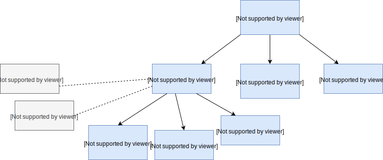

## An overview of data classes



## Seq

Other than `List`, there're more data collections that are sequential. All are **subclasses** of collection `seq`.

`List` are *linear*, so the access of elements is not *even* : get the `(n)th` one is always faster than the `(n+1)th` one.

### Vector
Instead of a recursive tree, `Vector` is a shallow tree, by storing up to 32 elements in a flat row, then each of the element is linked to one level down with respectively another row of 32 elements (the same principle as `B-tree` in database)

- Accessor

  As you can imagine the steps needed to access a elements now is proportional to the **depth of tree**, not to the **length of elements**. In `Vector`, it's $\theta(log_{32}(N))$.

- for bulk operation it will be faster than `List`, you can do that in chunks of 32.

- you can apply every possible operators on `Vector` just as on `List`, with exception of `cons`, instead of `::`, it will be `x +: vectorX` for prepend, and `vectorX :+ x` for append. The append `:+` is also with a complexity of $\theta(log_{32}(N))$

> Q: for append we could also use `:+` on List? 

> A: yes, and the complexity is $\theta(n)$

### Note on Array & String
`Array` and `String` also support *all the methods* on `Seq`, and can be convert to sequence if needed, but they cannot be subclass to `Seq` because they come from Java

### Range

Represent a sequence of **evenly spaced integers**

Three operators:
- `to` (inclusive)
- `until` (exclusive)
- `by` (steps)

```scala
1 to 11 by 2 //1,3,5,7,9,11

1 until 11 by 2 //1,3,5,7,9

11 until 1 by -2 //11,9,7,5,3
```

### some more sequence operators
- `xs exists p`
- `xs forall p`
- `xs zip ys`: create a sequence of pairs
- `xs unzip`: if `xs` is a pairs sequence
- `xs flatMap f`: apply *collection-valued function* `f` (so this function could create a `List` or some other sequences for each element of the `xs`) to the sequence and concatnate (flat) the results. EX:

  ```scala
  val n = 4
  val m = 8
  (1 to n) flatMap (x => (1 to m) map (y => (x, y)))

  // res0: IndexedSeq[(Int, Int)] = Vector((1,1), (1,2), (1,3), (1,4), (1,5), (1,6), (1,7), (1,8), (2,1), (2,2), (2,3), (2,4), (2,5), (2,6), (2,7), (2,8), (3,1), (3,2), (3,3), (3,4), (3,5), (3,6), (3,7), (3,8), (4,1), (4,2), (4,3), (4,4), (4,5), (4,6), (4,7), (4,8))
  ```

- `xs sum` & `xs prod`: only for numeric sequences
- `xs max` & `xs min`: must supply an `Ordering`

Exercise:

```scala
// it's an ineffecient method but highly abstract and corresponding to math definition

def isPrime(n: Int): Boolean = (2 until n) forall (d => n % d != 0)
```

### for expression
`for (s <- Seq if p(s)) yield f(s)`

is the same as saying: 

`Seq filter p map f`

To generalize the for expression:

```scala
/*
We can use `{}` instead of `()` to be able to write multiple generators in multiple lines
*/
for {
  s1 <- Seq1 // generator 1
  s2 <- Seq2 // generator 2
  ...
  sN <- SeqN // generator n
  if p(s1, ...sN) // filter/predict function (optional)
} yield f(s1, ...sN) // map function
```

## Set

更接近数学上set（集合）的定义

- `Set` is *unordered*
- `Set` has *no duplicate* elements
- main operator for `Set` is `contains`

All possible `Set` operators [doc](https://docs.scala-lang.org/overviews/collections/sets.html)

## Map

`Map[Key, value]`:

- `Map` in scala is both an association *data structure*, and a *function*

  ```scala
  val someMap = Map(1 -> "a", 2 -> "b", 3 -> "c")

  // Map as a function (precisely a partial function, which might envoke an error if try to get a non-exist key)
  someMap(1) // String = a

  // to avoid NoSuchElementExcpetion error, use `get`
  someMap get 4 // Option[String] = None

  someMap get 3 // Option[String] = Some(c)

  // Or turn Map into a total function by giving a default value, then we can avoid the pattern match of `Option` when using the Map
  val someMap1 = someMap withDefaultValue "unknown"
  someMap1(6)
  // String = unknown

  ```

- All methods like `map`, `flatMap` can be used on Map, including for expression

- `orderBy` & `groupBy`

  `groupBy` will give a `Map` of collections with the discriminator `f`, Ex:

  ```scala
  val a = List("apple", "pineapple", "pear", "orange")
  // group by first char in each string
  a.groupBy(_.head)

  // scala.collection.immutable.Map[Char,List[String]] = HashMap(a -> List(apple), p -> List(pineapple, pear), o -> List(orange))
  ```


