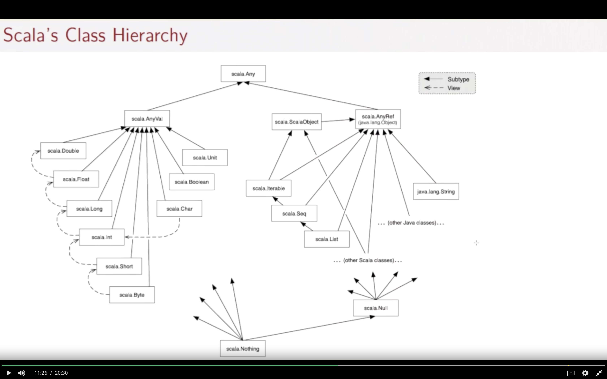
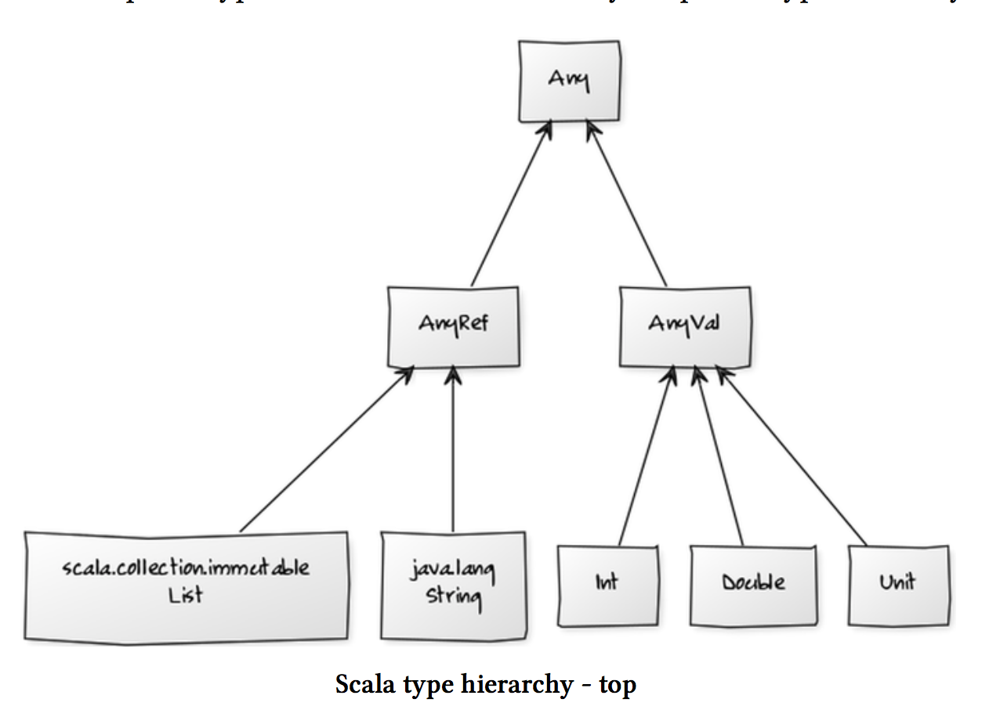

## Top types



- 要不就属于**Primitive types** (包括 Unit), 继承自`AnyVal`, 
- 要不就属于**reference types** (including user-defined classes)，继承自`AnyRef`. `AnyRef`里包含了很多scala collection的东西，`List`, `Array`等等，继承于至少**两个superclasses**: `java.lang.String`, 以及`scala.ScalaObject` 

## Bottom Type:
- `Nothing` -> `Nothing` is the type of like `throw new SomeException`
- `Null` -> `Null` is the the **subtype of all** objects, and is the type of value `null`

## 确定一个value的type

我们可以使用 `isInstanceOf` 来确定一个东西的type.

比如定义了一个method greet2:

```scala
def greet2(name: String) : String = “goodbye “ + name

greet2.isInstanceOf[AnyRef]
res10: Boolean = true

greet2.isInstanceOf[Object]
res11: Boolean = true

// 注意此处 scala.AnyRef 就是 java.lang.Object, 所以第二个判断也返回为true
```

> But the author said NEVER use `isInstanceOf` or `asInstanceOf` ???

## Type erasure:
As type doesn't affect program evaluation, it's only useful on compile time, lots of languages including Scala will have **type erasure** for the runtime


## Polymorphism & type:

### Polymorphism means "many forms", it has 2 principle forms:

- **subtyping**: instance of a subclass can be passed to a baseclass => 就是说如果一个class `A`是另外一个`B`的subclass, 就意味着`A`也是`B`的*subtype*，此时任何需要使用到`type B`的地方，你都可以使用`type A`，因为A属于B的**子集**
- **generics**: instance of a function or class are created by *type parameterization* => 说人话，就是在initialize一个instance的时候(不管是function还是class), 根据传入的param的type的不同，可以有不同的行为（例如param是`Boolean`就直接返回，如果是`Int`就加上一个啥再返回). 

  This also holds for *methods* : scala has **overloading**, so you can define multiple methods with the **same name** but take **different argument type**, and the compiler will figure out which method to use depending on the passed in argument.

历史上来说，**subtyping**是OO先应用的，而**generics**是fp先应用的

### Interaction between those 2 forms:
- **bounds**

  Notations:
    - `S <: T` means `S` is a *subtype* of `T` ( **upper bound** )
    - `S >: T` means `S` is a *supertype* of `T`, or,  `T` is a *subtype* of `S` ( **lower bound** )

  Usage like `[S >: NonEmpty <: IntSet]`, which means `S` is a supertype of `NonEmpty`, and is the subtype of `IntSet`.

- **variance**
  
  **Covariance**: given `NonEmpty` is a subtype of `IntSet`, is `List[NonEmpty]` a subtype of `List[IntSet]` ?

  ```scala
  NonEmpty <: IntSet

  // is that true ?
  List[NonEmpty] <: List[IntSet]
  ```

  We call those *types* **covariant**, 即这一类types之间的subtyping relationship，是会随着type parameter的变化而varies的。（此处这个covariant是`List`)

  A problem with *covariant* is the **Liskov substitution principle**, which says if `A <: B`, then anything you can do with element belongs to type `B`, should be able to be applied with an element belongs to type `A`.
  
  理论上应该成立，但考虑`NonEmpty`和`IntSet`这两者，如果有个地方可以使用`IntSet`, 然后assign了一个`Empty`type, 结果会变成试图使一个`NonEmpty`的element变成`Empty`...在java里这会导致一个runtime error, 而在scala里是一个compile time error, 依据的就是使用的data type是否是一个*covariant*. 

  ```scala
  val a: Array[NonEmpty] = Array(new NonEmpty(1, Empty, Empty))
  val b: Array[IntSet] = a // scala compiler type error will be raised at this line, because "Array" in scala is NOT a covariant
  b(0) = Empty
  val s: NonEmpty = a(0)
  ```

  > Q: 所以整体上来说，问题应该在于对于immutable的data type,我们可以称之为covariant type， 但对于mutable的data type不行 ？因为感觉这个东西的问题好像在于re-assign ？

  > A: good caught, 基本上就是这个原因。但即使是immutable的data type， 也需要满足一定的条件，才能成为covaraint. see the section below:

### What makes a type covaraint

Given a parameterized type `C[T]`, and 2 types `A`, `B`, where `A <: B`, the type of `C[A]` & `C[B]` can have 3 possible relationships:

- `C[A] <: C[B]` --> `C` is **covariant**
- `C[A] >: C[B]` --> `C` is **contravariant**
- `C[A]` and `C[B]` don't have any subtype relationship --> `C` is **nonvariant** (or **invariant**)

In scala, you can specify the variance of a type by *annotating* the type

- `C[+T]` --> covariant
- `C[-T]` --> contravariant
- `C[T]` --> nonvariant

#### subtype of function types
**if `A2 <: A1` and `B1 <: B2`, then `A1 => B1 <: A2 => B2`**

*Detailed explaination*: 

say we have `f1: A1 => B1`, and `f2: A2 => B2`, anywhere when we use `f2`:

- the parameter passed must be an element belongs to `A2`, and as `A2 <: A1`, it will surely satisfy the `A1`, which is the param type of `f1`.
- the return type of `f2` is of type `B2`, as `B1 <: B2`, it means the returned value is a supertype of `B1`, so it will contain the set of `f1`'s expected results 

This means anywhere we use type `f2`, we can replace it by the type `f1`, according to *Liskov substitution principle*, we can say `f1` is the subtype of `f2`, thus `A1 => B1 <: A2 => B2`.

So we can say *function type* is a **contravariant** of its **arguments types**, and a **covariant** of its **result types**. If we formalize that:

```scala
package scala

// instead of writing this
// trait Function1[A, B] {
//   def apply(x: A): B
// }

// we can write
trait Function1[-T, +U] {
  def apply(x: T): U
}
```

#### why array (or mutable data type) cannot be covariant

if we write array (or any mutable data type) in class form, it must have a `update` method somewhere, which takes the the param type `T`, and update it.

```scala
class Mutable[+T] {
  //...
  def update(x: T) = ...
  //...
}
```

But as we've proved in the case of function type, any function type should be the *contravariant* of its param type, it cannot be a *covariant* of its param. 

Based on that, we can have the **rules of variance check** (aka how to think like a scala compiler 🤖):

- *covariant* type params (`[+T]`) can only appear in method *results* (or it can be the *lower bounds* of method params)
- *contravariant* type params (`[-T]`) can only appear in method *params* (or it can be the *upper bounds* in method results)
- *nonvariant* type params (`[T]`) can appear *anywhere*

#### It's sometimes a bit harder to make a class covariant
see the [List implementation](../src/main/scala/week4/NonPrimitive.scala), if we want to add an `prepend` method inside trait List, (namely `def prepend(elem: T): List[T] = new Cons(elem, this)`) we run into the same problem as the `update` in mutable data type: the covariant type param appears in method param, so it violates the variance check rules above.

But the variance check rules are invented to prevent *mutable operations* in covariant classes, and here we are not mutating anything because we return a new `Cons` 💩. 

However, this prevention **IS** correct even we don't mutate anything --> think we can prepend an `Empty` element to a `List[IntSet]`, where we originally can replace (substitute) the usage of `List[IntSet]` by `List[NonEmpty]`, now we cannot, `List[NonEmpty]` is no longer a subtype of `List[IntSet]`.

To make the `prepend` method within covariant classes, we need to use the **lower bound** mentionned above:

```scala
trait List[+T] {
  //...
  def prepend[U >: T](elem: U): List[U] = new Cons(elem, this)
  //...
}
```

> Q: but that means we can no longer prepend an `Empty` to a `List[IntSet]` ? otherwise how the Liskov substitution principle works that out ?

> A: No, think about `def f(xs: List[NonEmpty], x: Empty) = xs prepend x`, the result will be of type `List[IntSet]` 🎉.

> Because the element to be prepended is not the same type as the `List[NonEmpty]`, so we parameterize the type of `prepend` method to be the **smallest** superset `U` that contains both `NonEmpty` and the prepended element (`Empty` in our case), so the `U` will be `IntSet`, so finally we got back a `List[IntSet]`. 

> And this way, we can safely substitute the usage of `List[IntSet]` by `List[NonEmpty]`, even when we prepend a `Empty` element -- as it automatically turns the `List[NonEmpty]` to `List[IntSet]` if necessary.

## ADT

所谓的**Algebraic Data Type**的缩写。
基本就是说，这种Data Type是某几种别的types的combination.

比如`List`就是一个ADT, 它由一个**EmptyList** (represent by object `Nil`) 以及**non-empty list** (represent by `::`)组成

ADT一般由一个`sealed trait` 然后 `case classes` (or `case objects` if not aggregate infos) 组成 

**Example**:

```scala
sealed trait Symbol

case class Note(
    name: String,
    duration: String,
    octave: Int
) extends Symbol

case class Rest(
    duration: String
) extends Symbol
```

The trait `Symbol` has defined some ADT, which is either a `Note`, or a `Rest`: 
- Inside `Note`, we have `name`, `duration` and `octave` infos
- and inside `Rest` we only have `duration`.

Then we can init some values with this ADT:

```scala
val symbol1: Symbol = Note("C", "whole", 3)
val symbol2: Symbol = Rest("half")
```

Finally we could define some function, ex get the duration from type Symbol:

```scala
def SymbolDuration(symbol: Symbol): String =
    symbol match {
        case Note(name, duration, octave) => duration
        case Rest(duration) => duration
    }

SymbolDuration(symbol1)
res0: String = whole

SymbolDuration(symbol2)
res1: String = half
```

**Another Example**:

We can further use `case objects` to make sure that the `name` of a `Note` can only be one of `A,B,C,D,E,F,G` (as other string can pass the validation but makes no sense)

```scala
sealed trait NoteName

case object A extends NoteName
case object B extends NoteName
case object C extends NoteName
case object D extends NoteName
case object E extends NoteName
case object F extends NoteName
case object G extends NoteName
```

And then for the duration:

```scala
sealed trait Duration

case object Whole extends Duration
case object Half extends Duration
case object Quarter extends Duration
```

Then we can seal our musical `Symbol` type as follow:

```scala
sealed trait Symbol

case class Note(
    name: NoteName,
    duration: Duration,
    octave: Int
) extends Symbol

case class Rest(
    duration: Duration
) extends Symbol
```

finally we change the get duration function to tell it to return a type of `Duration`:

```scala
def SymbolDuration(symbol: Symbol): Duration =
    symbol match {
        case Note(name, duration, octave) => duration
        case Rest(duration) => duration
      }
```

### Some important builtin ADTs:

- `Option[T]` => `None` or `Some[T]`
- `Try` => `Failure` or `Success[T]`
- `Future`
- `Either[A, B]` => `Left[A]` or `Right[B]`

