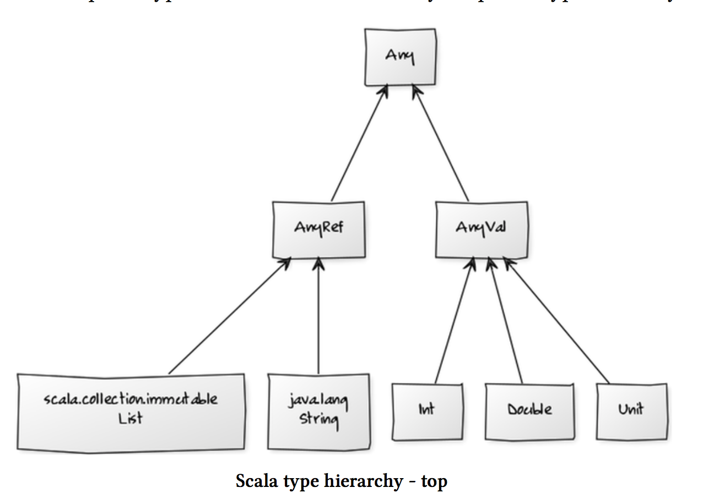

## Top types



- 要不就属于**Primitive types** (包括 Unit), 继承自`AnyVal`, 
- 要不就属于**reference types** (including user-defined classes)，继承自`AnyRef`. `AnyRef`里包含了很多scala collection的东西，`List`, `Array`等等，继承于至少**两个superclasses**: `java.lang.String`, 以及`scala.ScalaObject` 

## Bottom Type:
- `Nothing` -> `Nothing` is the type of like `throw new SomeException`
- `Null` -> `Null` is the the **subtype of all** objects, and is the type of value `null`

## Type erasure:
As type doesn't affect program evaluation, it's only useful on compile time, lots of languages including Scala will have **type erasure** for the runtime


## Polymorphism & type:
Polymorphism means "many forms", it has 2 principle forms:

- **subtyping**: instance of a subclass can be passed to a baseclass => 就是说如果一个class `A`是另外一个`B`的subclass, 就意味着`A`也是`B`的*subtype*，此时任何需要使用到`type B`的地方，你都可以使用`type A`，因为A属于B的**子集**
- **generics**: instance of a function or class are created by *type parameterization* => 说人话，就是在initialize一个instance的时候(不管是function还是class), 根据传入的param的type的不同，可以有不同的行为（例如param是`Boolean`就直接返回，如果是`Int`就加上一个啥再返回).
- scala has **overloading**, so you can define multiple methods with the **same name** but take **different argument type**, and the compiler will figure out which method to use depending on the passed in argument

历史上来说，**subtyping**是OO先应用的，而**generics**是fp先应用的


### 我们可以使用 `isInstanceOf` 来确定一个东西的type

比如定义了一个method greet2:

```scala
def greet2(name: String) : String = “goodbye “ + name

greet2.isInstanceOf[AnyRef]
res10: Boolean = true

greet2.isInstanceOf[Object]
res11: Boolean = true

// 注意此处 scala.AnyRef 就是 java.lang.Object, 所以第二个判断也返回为true
```

> But the author said NEVER use `isInstanceOf` or `asInstanceOf` ???

## ADT

所谓的**Algebraic Data Type**的缩写。
基本就是说，这种Data Type是某几种别的types的combination.

比如`List`就是一个ADT, 它由一个**EmptyList** (represent by object `Nil`) 以及**non-empty list** (represent by `::`)组成

ADT一般由一个`sealed trait` 然后 `case classes` (or `case objects` if not aggregate infos) 组成 

**Example**:

```scala
sealed trait Symbol

case class Note(
    name: String,
    duration: String,
    octave: Int
) extends Symbol

case class Rest(
    duration: String
) extends Symbol
```

The trait `Symbol` has defined some ADT, which is either a `Note`, or a `Rest`: 
- Inside `Note`, we have `name`, `duration` and `octave` infos
- and inside `Rest` we only have `duration`.

Then we can init some values with this ADT:

```scala
val symbol1: Symbol = Note("C", "whole", 3)
val symbol2: Symbol = Rest("half")
```

Finally we could define some function, ex get the duration from type Symbol:

```scala
def SymbolDuration(symbol: Symbol): String =
    symbol match {
        case Note(name, duration, octave) => duration
        case Rest(duration) => duration
    }

SymbolDuration(symbol1)
res0: String = whole

SymbolDuration(symbol2)
res1: String = half
```

**Another Example**:

We can further use `case objects` to make sure that the `name` of a `Note` can only be one of `A,B,C,D,E,F,G` (as other string can pass the validation but makes no sense)

```scala
sealed trait NoteName

case object A extends NoteName
case object B extends NoteName
case object C extends NoteName
case object D extends NoteName
case object E extends NoteName
case object F extends NoteName
case object G extends NoteName
```

And then for the duration:

```scala
sealed trait Duration

case object Whole extends Duration
case object Half extends Duration
case object Quarter extends Duration
```

Then we can seal our musical `Symbol` type as follow:

```scala
sealed trait Symbol

case class Note(
    name: NoteName,
    duration: Duration,
    octave: Int
) extends Symbol

case class Rest(
    duration: Duration
) extends Symbol
```

finally we change the get duration function to tell it to return a type of `Duration`:

```scala
def SymbolDuration(symbol: Symbol): Duration =
    symbol match {
        case Note(name, duration, octave) => duration
        case Rest(duration) => duration
      }
```

### Some important builtin ADTs:

- `Option[T]` => `None` or `Some[T]`
- `Try` => `Failure` or `Success[T]`
- `Future`
- `Either[A, B]` => `Left[A]` or `Right[B]`

